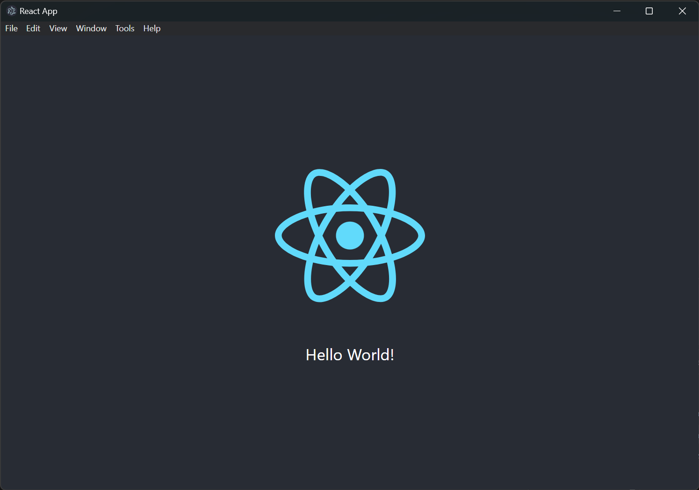
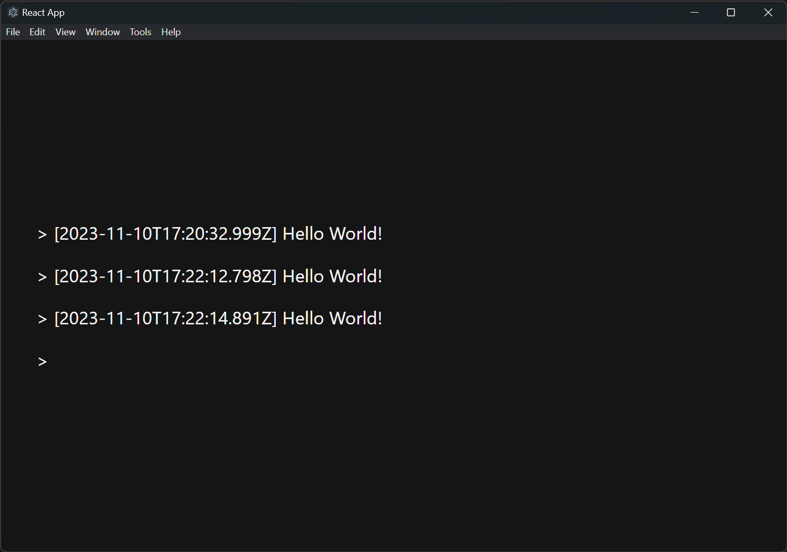

# electron-node

A simple project demonstrating how to spawn an Express app from Electron as well as providing server logs directly in the Electron app using React.

## Express App:

Click on `Tools -> Toggle Logs` to show the server log:

## Available Scripts

### `npm run development`
Runs the app in the development mode.\
Open [http://localhost:3000](http://localhost:3000) to view it in your browser.

The page will reload when you make changes.\
You may also see any lint errors in the console.

### `npm start`
Runs the app in the production mode.\
Open [http://localhost:5000](http://localhost:5000) to view it in your browser.

### `npm run electron-dev`
Runs the app in the development mode inside Electron.\

The page will reload when you make changes.\
You may also see any lint errors in the console.

## How to package

### `npm run make`
Package the app using `electron-forge`

## Author

Giuseppe Farinacci &lt;giuseppe.farinacci@gmail.com&gt;

Updated on: 10 November 2023

## Acknowledgement

Based on [electron-with-express](https://github.com/frankhale/electron-with-express) by [Frank Hale](https://github.com/frankhale)

## License

MIT - see [LICENSE](LICENSE)